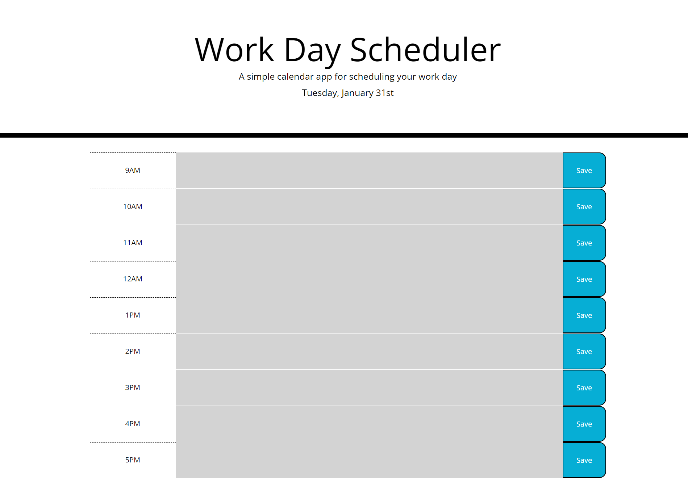

# Planner-App

# Description
The task for this assignment requires to create a simple calendar application that allows a user to save events for each hour of the day.

# Screenshot

# Links
<ul>
  <li>GitHub Repository: https://github.com/valimanea/Planner-App</li>
  <li>Deployed application: https://valimanea.github.io/Planner-App/</li>
</ul>